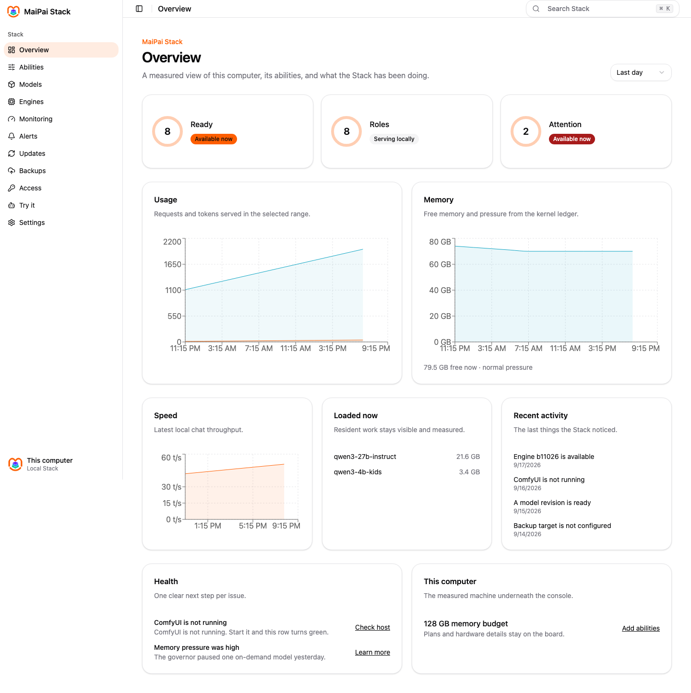
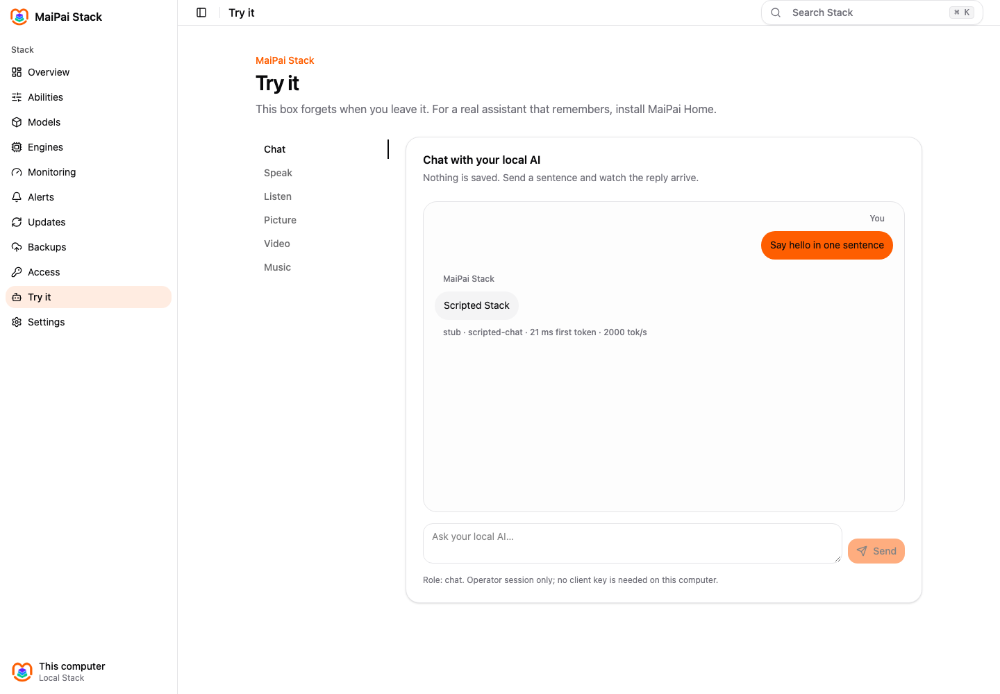
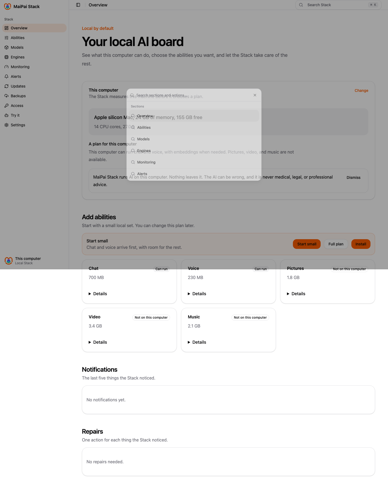
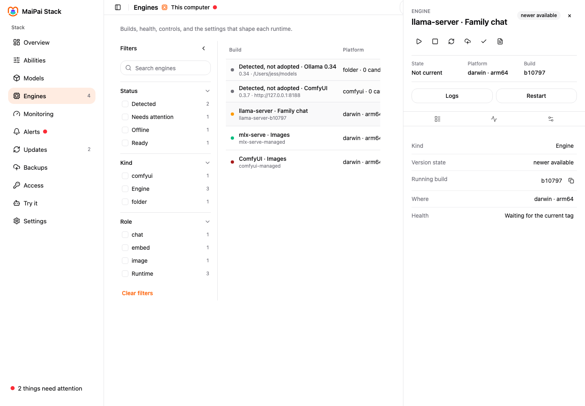

<p align="center">
  <image>
    <source media="(prefers-color-scheme: dark)" srcset="https://raw.githubusercontent.com/getmaipai/.github/main/brand/maipai-stack-logo-dark.png">
    
  </image>
</p>

<h3 align="center">Your own local AI stack, made easy.</h3>

<p align="center">
  
  
  
  
</p>

<p align="center"><a href="docs/dev.md">Documentation</a> · <a href="https://github.com/getmaipai/stack/releases">Releases</a></p>

The easy way to run your own local AI: the whole stack installed,
watched, tested and kept up to date on your own computer, for you and
anything you build on it. Nothing leaves your house.

## Why would I need this?

Because the AI you use today lives on someone else's computer. Every
question you ask, every photo you make, every note you dictate goes to
a company, is kept, and may be read or used. The Stack puts the same
kind of AI on your own computer, where nothing leaves the house.

**What it does for you.** You get an assistant you can talk to and
type to, that can listen and read aloud, make images and short
videos and music, and help you write and code, all running on the Mac
you already own, with no account and no subscription. Tools you already
use (a coding assistant, a notes app, a home hub) can use it too,
through one address, with a key you control.

**How it helps.** It does the part that usually stops people: it
measures your computer and picks what will run well on it, installs
and checks everything, keeps one eye on memory so nothing crashes,
tells you when something needs you and offers the fix, updates safely
with a way back, and stays out of your way the rest of the time. You
do not have to learn what a quantization is. And when someone else in
your house wants a turn, MaiPai Home installs on top with kid-safe
profiles and memory, one click.

## Why the Stack, and not doing it yourself

You can download Ollama for chat, LM Studio for a second opinion,
ComfyUI for images, a speech server for voice, and wire them up.
People do. Here is what you get from the Stack instead, and every
line is something it does or is designed to do, not a promise:

- **One address for everything.** Chat, coding, voice in and out,
  images, video and music sit behind one API, asked for by what you
  want ("chat"), never by which engine or file. Swap an engine and no
  tool you use breaks. On your own, that is five programs, five ports
  and five settings files.
- **Sized to your computer, measured, not guessed.** The Stack reads
  the kernel's own memory numbers and does a dry run before it loads a
  model, then keeps one memory budget across every engine, so a video
  job waits instead of crashing your chat. The tools people wire
  together each guess for themselves and step on each other.
- **You know what you are running.** Every model shows where it came
  from, its licence and its checksum before it can be used, and the
  Stack reuses models you already downloaded with other tools instead
  of pulling 40 GB twice.
- **It watches itself.** Health with one fix per problem, a
  notification center, alerts to your own Telegram or ntfy, updates
  with a drain, a swap and one-click go-back. On your own, you find out
  when it breaks.
- **Nothing leaves the house.** No account, no telemetry, no crash
  reports; an update check is opt-in and sends a version number. Some
  popular tools phone home on every launch.
- **Your family can join later.** The Stack is for one person; MaiPai
  Home installs on top when someone else in the house wants a turn,
  with kid-safe profiles and memory, and the hand-off is one click.
- **One command, no Docker,** the same on a Mac today and Linux and
  Windows to come, open source and yours (AGPL-3.0).

## Features

- **One address**: an OpenAI-compatible API for chat, coding, embeddings,
  voice in, voice out, images, video and music, by role, never by model
  name. (designed; the routes exist but no engine answers embeddings,
  voice or images yet)
- **Sized to your machine**: it measures what your computer can run and
  proposes a profile in plain words. (built)
- **Provenance first**: every model shows where it came from, its
  licence and its checksum before it can be used. (built)
- **One memory budget**: one governor decides what loads and what waits,
  so a video job never crashes your chat. (designed)
- **Watched**: a board of green lights, repairs with one action each,
  logs per engine. (designed)
- **Updates with rollback**: opt-in checks, one click to update, one
  click to go back. (designed)
- **Try it**: a stateless box per role to prove each one works.
  (chat shipped; voice and generators are honest offline/job-shaped states)
- **Client keys**: each tool gets a key limited to the roles it may use.
  (built)
- **Complete alone**: run it by itself, or install MaiPai Home on top for
  your family. (designed)

## Getting started

```bash
curl -fsSL https://getmaipai.github.io/stack/install.sh | sh
```

Then open `http://127.0.0.1:8770`. Health is at
`http://127.0.0.1:8770/healthz`, and the API explorer is at
`http://127.0.0.1:8770/api/docs`. The admin UI is at
`http://127.0.0.1:8770/`.
`GET /stack/v1/hardware` shows what this computer can run;
`GET /stack/v1/roles` lists every role and its state.

To uninstall the service and binary while keeping your data:

```bash
curl -fsSL https://getmaipai.github.io/stack/install.sh | sh -s -- --uninstall
```

## Status

Pre-alpha. On `main`, the Stack starts on one port, measures your
computer, downloads and verifies the chat engine, declares every role,
refuses a model without provenance, and binds chat to the engine. It has
no operator login and no board yet. MaiPai Home still runs the
household on its own engines until the Stack proves the hub's profile
on the Studio.

## Documentation

- Design record: [docs/dev.md](docs/dev.md)
- The experience: [docs/ux.md](docs/ux.md)
- Integrations (Home, Bot, Go, Catalog): [docs/integrations.md](docs/integrations.md)
- Privacy: [docs/user/privacy.md](docs/user/privacy.md)
- Issues: [github.com/getmaipai/stack/issues](https://github.com/getmaipai/stack/issues)

## Development

Standards live in [getmaipai/.github](https://github.com/getmaipai/.github).
`scripts/check.sh` runs the pinned `@maipai/standards` core; it needs a
sibling checkout of `getmaipai/.github`.

To judge the full UI with a believable household-sized fixture, build the
frontend and run `bun run showroom`. It serves the local showroom at
`http://127.0.0.1:8770`; `STACK_SHOWROOM=1` is a developer switch, never on by
default, and the backend refuses it in production.

---

MaiPai is open-source software for personal, self-hosted, non-commercial
use by you and your household. It is not affiliated with, endorsed by, or
sponsored by any platform it can connect to. All product names and
trademarks belong to their respective owners. You are responsible for
complying with the terms and laws that apply to you and the services you
access.

The models the Stack downloads are made by third parties and chosen by
you. What they produce can be wrong, offensive, or harmful, and is not
medical, legal, or professional advice. You are responsible for how you
use it.

Licensed under [AGPL-3.0](LICENSE).
