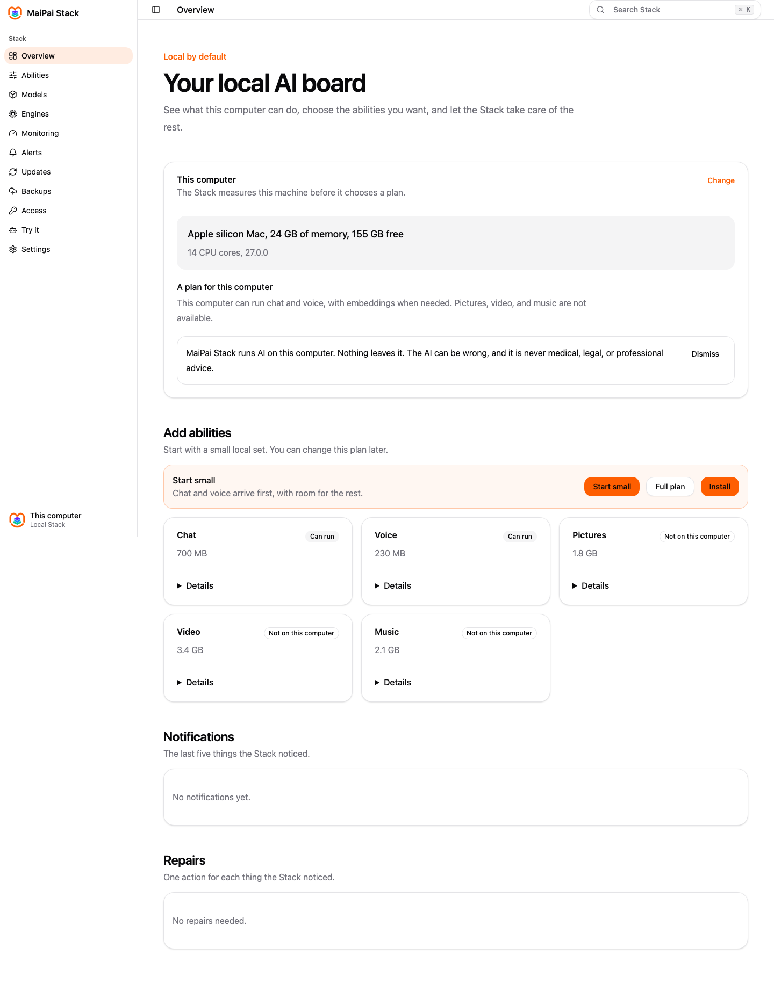

<p align="center">
  <picture>
    <source media="(prefers-color-scheme: dark)" srcset="https://raw.githubusercontent.com/getmaipai/.github/main/brand/maipai-stack-logo-dark.png">
    
  </picture>
</p>

<h3 align="center">Your own local AI stack, made easy.</h3>

<p align="center">
  
  
  
</p>

<p align="center"><a href="docs/dev.md">Documentation</a> · <a href="https://github.com/getmaipai/stack/releases">Releases</a></p>

The easy way to run your own local AI: the whole stack installed,
watched, tested and kept up to date on your own computer, for you and
anything you build on it. Nothing leaves your house.

## Features

- **One address**: an OpenAI-compatible API for chat, coding, embeddings,
  voice in, voice out, pictures, video and music, by role, never by model
  name. (designed; the routes exist but no engine answers embeddings,
  voice or pictures yet)
- **Sized to your machine**: it measures what your computer can run and
  proposes a profile in plain words. (built)
- **Provenance first**: every model shows where it came from, its
  licence and its checksum before it can be used. (built)
- **One memory budget**: one governor decides what loads and what waits,
  so a video job never crashes your chat. (designed)
- **Watched**: a board of green lights, repairs with one action each,
  logs per engine. (designed)
- **Updates with rollback**: opt-in checks, one click to update, one
  click to go back. (designed)
- **Try it**: a stateless box per role to prove each one works.
  (chat shipped; voice and generators are honest offline/job-shaped states)
- **Client keys**: each tool gets a key limited to the roles it may use.
  (built)
- **Complete alone**: run it by itself, or install MaiPai Home on top for
  your family. (designed)

## Getting started

```bash
curl -fsSL https://getmaipai.github.io/stack/install.sh | sh
```

Then open `http://127.0.0.1:8770`. Health is at
`http://127.0.0.1:8770/healthz`, and the API explorer is at
`http://127.0.0.1:8770/api/docs`. The admin UI is at
`http://127.0.0.1:8770/`.
`GET /stack/v1/hardware` shows what this computer can run;
`GET /stack/v1/roles` lists every role and its state.

To uninstall the service and binary while keeping your data:

```bash
curl -fsSL https://getmaipai.github.io/stack/install.sh | sh -s -- --uninstall
```

## Status

Pre-alpha. On `main`, the Stack starts on one port, measures your
computer, downloads and verifies the chat engine, declares every role,
refuses a model without provenance, and binds chat to the engine. It has
no operator login and no board yet. MaiPai Home still runs the
household on its own engines until the Stack proves the hub's profile
on the Studio.

## Documentation

- Design record: [docs/dev.md](docs/dev.md)
- The experience: [docs/ux.md](docs/ux.md)
- Integrations (Home, Bot, Go, Catalog): [docs/integrations.md](docs/integrations.md)
- Privacy: [docs/user/privacy.md](docs/user/privacy.md)
- Issues: [github.com/getmaipai/stack/issues](https://github.com/getmaipai/stack/issues)

## Development

Standards live in [getmaipai/.github](https://github.com/getmaipai/.github).
`scripts/check.sh` runs the pinned `@maipai/standards` core; it needs a
sibling checkout of `getmaipai/.github`.

---

MaiPai is open-source software for personal, self-hosted, non-commercial
use by you and your household. It is not affiliated with, endorsed by, or
sponsored by any platform it can connect to. All product names and
trademarks belong to their respective owners. You are responsible for
complying with the terms and laws that apply to you and the services you
access.

The models the Stack downloads are made by third parties and chosen by
you. What they produce can be wrong, offensive, or harmful, and is not
medical, legal, or professional advice. You are responsible for how you
use it.

Licensed under [AGPL-3.0](LICENSE).
