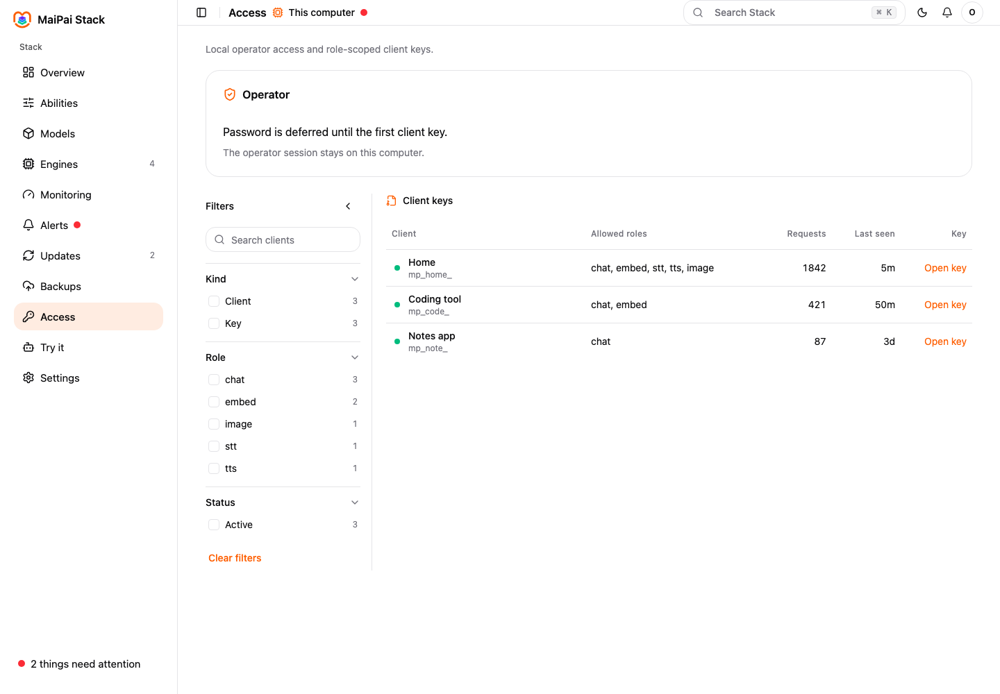

1. Open **Settings**, then choose **Clients**.
2. Choose **New key** and name it for the tool.
3. Allow **Coding** and **Chat**, then choose **Create key**.
4. Copy the key now. Stack shows it once.



Give your tool the local Stack address shown on the Clients page, the key, and this model name:

```text
coding
```

Tools that use the OpenAI-compatible chat API work today. Editors or agents that need a different protocol do not work yet.

To stop a tool, return to **Clients**, choose its key, and choose **Revoke**.

Still need help? Open [Fix a problem](./fix-a-problem/).
