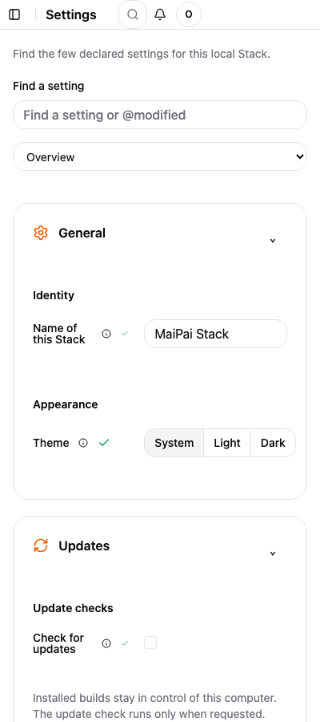

1. On the computer that runs Stack, open **Settings**, then **Network and access**.
2. Set an operator password if you do not have one.
3. Turn on **LAN access**, then restart Stack when asked.
4. On your phone, join the same home Wi-Fi.
5. Open the address shown under **LAN access** and enter the operator password.

The phone layout has the board, models, tester, and settings in a smaller view. To close access, turn off **LAN access** on the computer and restart Stack.

Still need help? Open [Fix a problem](./fix-a-problem/).
