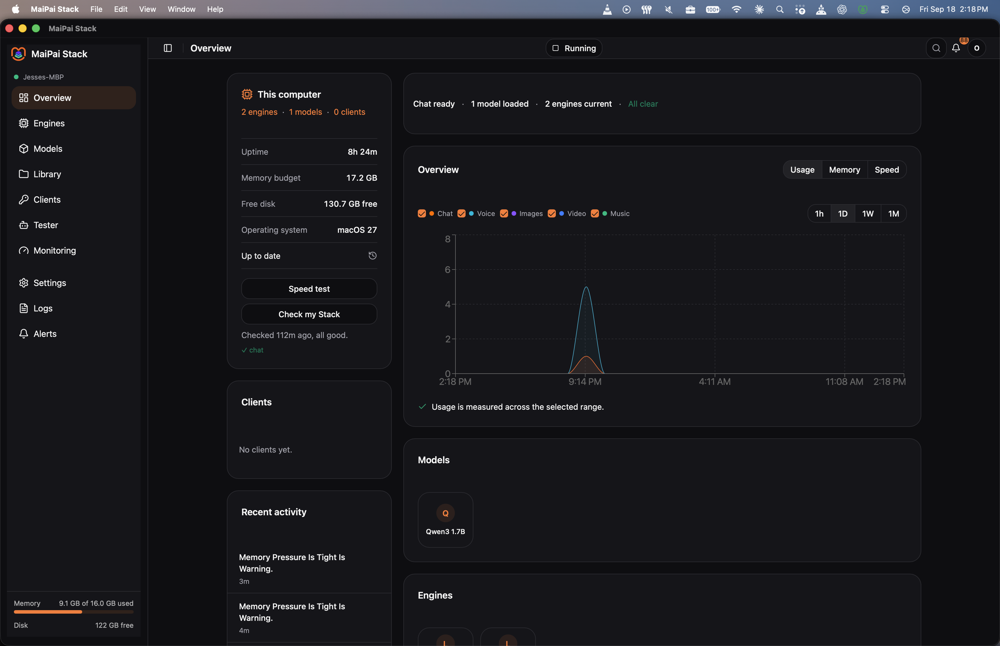

# The tray

The MaiPai Stack icon shows the local Stack status. Green means all roles are
well. Yellow means a warning. Red means something needs attention. A paused
Stack uses the paused icon. If the daemon is down, the menu says so and offers
Start.

The menu shows the instance, each role, memory use, and the last check. Open
the console with **Open the Stack**. Use **Pause everything** or **Resume** to
change run state, **Check my Stack** to run a health check, and **Open Logs**
to see local logs. **Quit the app (the Stack keeps running)** closes only the
tray app.

## Notifications

Notifications come from important saved events only. Choose model installs,
updates, failed checks, and health attention in **Settings > Alerts**. Pause
and resume notifications are off until you turn them on. Each notification
opens the related page. Progress updates never interrupt you.

Still need help? Open [Fix a problem](./fix-a-problem/).
