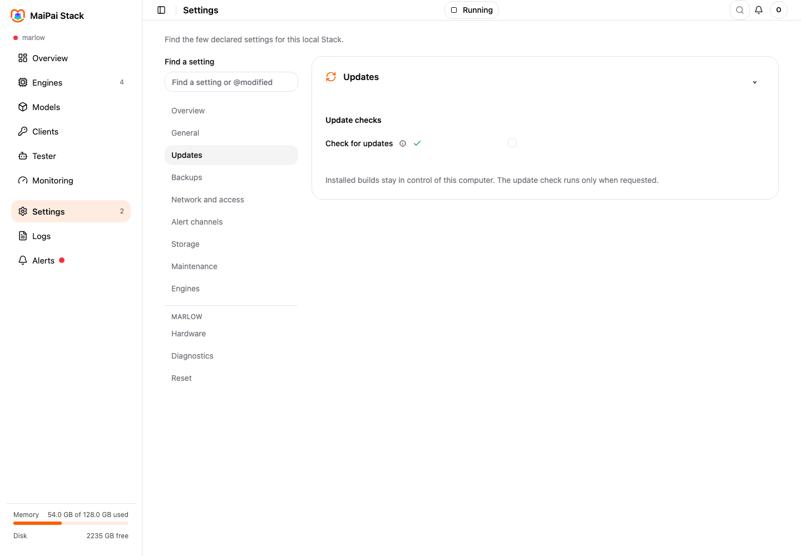

1. Open **Settings**, then choose **Updates**.
2. Switch on **Check for updates** if it is off.
3. Read **What changed**, then choose **Install update**.
4. Wait for Stack to restart.
5. If the new version causes a problem, choose **Go back one version**.

Stack keeps your settings, keys, models, and data. Turn off the update switch when you want Stack to stay on its current version.

Still need help? Open [Fix a problem](./fix-a-problem/).
